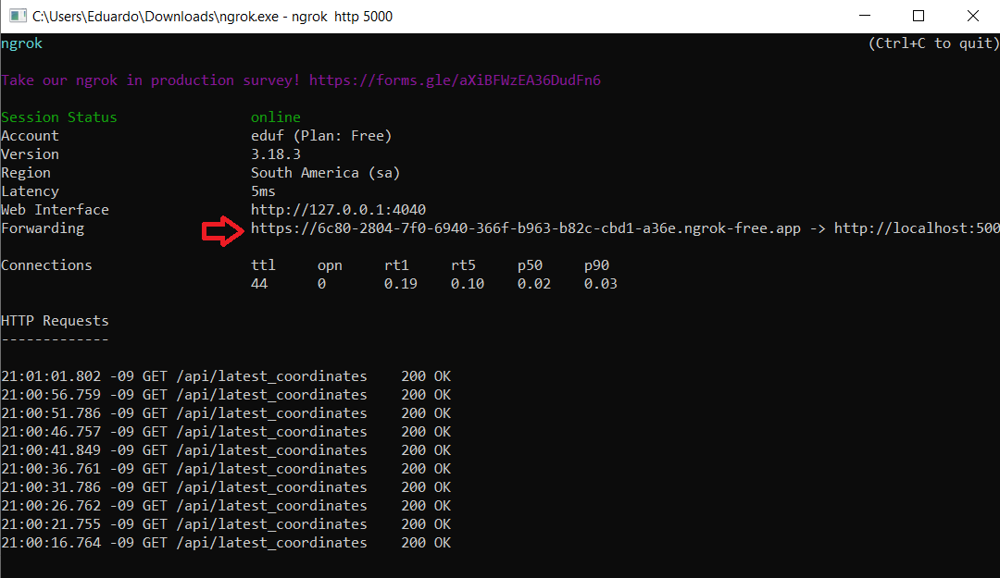

## Introdução
Este projeto foi desenvolvido para a disciplina Computação Física e Aplicações, em conjunto com uma turma do curso de Textil e Moda. Consiste em uma aplicação que envolve microcontrolador, comunicação via rede e 
uma interface web para monitoramento e controle de dispositivos. Em termos de software, ele é composto por três partes principais: um servidor web Flask, código para execução no microcontrolador (ESP32) e uma 
página HTML que interage com o servidor.

A principal funcionalidade consiste em enviar dados de geolocalização para o servidor, que os utiliza para marcar em um mapa e atualizar em tempo real a posição do microcontrolador. Além disso, foram incluídos 
dois LEDs ao circuito para explorar a possibilidade de controle remoto de outros dispositivos.

### 1. Servidor Web (app.py)
O servidor web, desenvolvido em Flask, é responsável por gerenciar as requisições e interagir com os dispositivos que enviam dados e ligam/desligam os LEDs. Ele possui várias rotas para realizar diferentes funções:

  - Receber coordenadas (POST /api/coordenadas): Esta rota serve para receber coordenadas de latitude e longitude enviadas pelo microcontrolador; 
  - Obter últimas coordenadas (GET /api/latest_coordinates): Usada para informar as últimas coordenadas recebidas pelo servidor, permitindo que a interface web as visualize em tempo real;
  - Controlar LEDs (POST /api/led1, POST /api/led2): Estas rotas permitem que a interface web envie comandos para ligar ou desligar os LEDs conectados ao microcontrolador;
  - Obter estado dos LEDs (GET /api/led_states): Criada para permitir saber o estado (ligado ou desligado) dos LEDs. Esse estado é exibido no terminal;
  - A última rota é responsável pelo acesso à página web (/).

### 2. Código do Microcontrolador (main.py)
O código do arquivo main.py é responsável por conectar o ESP32 à rede e faz a comunicação dele com o servidor.

  - connect_wifi(): O microcontrolador se conecta a uma rede (Wi-Fi ou móvel) utilizando credenciais fornecidas (SSID e senha). Esta conexão é essencial para a comunicação com o servidor Flask.
  - update_gps_data(): Leitura periódica e acionamento de envio (quando obtém uma posição válida) dos dados do GPS;
  - send_coordinates(lat, lon): Função responsável pelo envio das coordenadas via requisição HTTP;
  - update_leds(): Consulta o servidor para obter o estado dos LEDs e os aciona conforme o comando recebido.

### 3. Interface Web (index.html)
A interface web permite que o usuário visualize as coordenadas geográficas recebidas em tempo real e controle os LEDs. Ela é composta por:
  - Exibição de coordenadas: As últimas coordenadas de latitude e longitude recebidas são exibidas na tela, e a API do Google Maps é utilizada para mostrar a localização geográfica.
  - Controle dos LEDs: A interface oferece botões para ligar e desligar os LEDs.
  - Atualização em tempo real: A página web realiza uma requisição a cada 3 segundos para atualizar as coordenadas e a posição do marcador no mapa.

## Execução
1. Acesse a pasta pelo terminal e execute o comando _python app.py_
2. Na linha 14 do main.py substitua NOME_DA_REDE e SENHA pelas informações da rede que será conectada ao ESP32
3. Se ESP32 e a  máquina com o servidor estiverem conectados à mesma rede, substitua ENDERECO_SERVIDOR nas linhas 45 e 58 do main.py pelo ip informado no terminal

4. Quando o microcontrolador estiver conectado a uma rede móvel, é preciso haver um túnel para a comunicação e o servidor precisa ser deixado online. Nesse caso, a definição do endereço vai depender de isso for feito.
5. No index.html, linha 64, substitua CHAVE pela key da API do Google Maps
6. Acesse o endereço do servidor em um navegador.

### API do Maps
Foi obtida utilizando o período de teste do Google Cloud [(https://cloud.google.com/?hl=pt-BR)](https://cloud.google.com/?hl=pt-BR)

### ngrok
Foi a solução utilizada para a criação do túnel de comunicação entre ESP e servidor. Além da criação desse túnel, ele fornece uma url na qual a interface da aplicação pode ser acessada.
Utilização:
1. Faça o download do programa [https://download.ngrok.com/windows?tab=download](https://download.ngrok.com/windows?tab=download)
2. Crie uma conta em [https://dashboard.ngrok.com/signup](https://dashboard.ngrok.com/signup)
3. Gere um token [https://dashboard.ngrok.com/get-started/your-authtoken](https://dashboard.ngrok.com/get-started/your-authtoken)
4. Executar ngrok.exe e os comandos
  - _ngrok config add-authtoken ESCREVA_AQUI_O_TOKEN_
  - _ngrok http 5000_
5. O primeiro link na linha Forwarding é o endereço do servidor e pode ser acessado via internet

.

